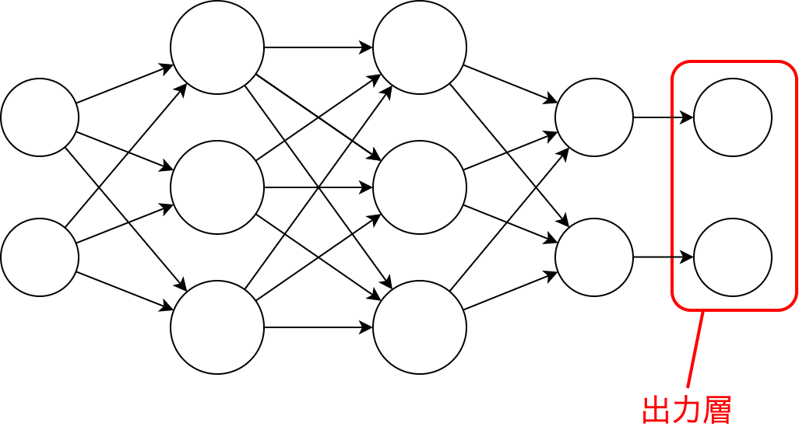

--- 
marp: true
math: katex
header: "第4回 出力層の設計"
footer: "2022/11/17 ゼロイチゼミ: <a href=\"https://twitter.com/nu_zero_one\" style=\"color:white\">@nu_zero_one</a>"
theme: 01semi
paginate: true
---

<!--
_class: title
_paginate: false
-->
# 2. 出力層の設計
### 甲本健太

---

## 出力層とは
出力層（ニューラルネットワークの最後の部分）

---

## 出力関数の種類

#### 恒等関数
- 与えられた入力をそのまま返す関数
- 主に**回帰問題**で利用

#### ソフトマックス関数
- 総和が1になるように分配する関数
- 主に**分類問題**で使用

---

## 回帰問題・分類問題って？

#### 分類問題
- 入力データがどのクラスに属するか分類する
- 「手書き数字の認識」など

#### 回帰問題
- 入力データ数値の予測を行う
- 「株価の予想」など

---

## 恒等関数 (*identity function*)

- 入力をそのまま返す

---

## ソフトマックス関数 (*softmax function*) 1/2

- 各入力を全ての入力の相対値にして返す

---

## ソフトマックス関数 (*softmax function*) 2/2

#### 計算方法
1. **全ての入力の指数**を計算：$a'_k = e^{a_k},\ S=\sum_{i=1}^{n}a'_k$
2. 正規化する　　　　　　：$y_k = a'_k/S$

#### なぜ指数？

- 
